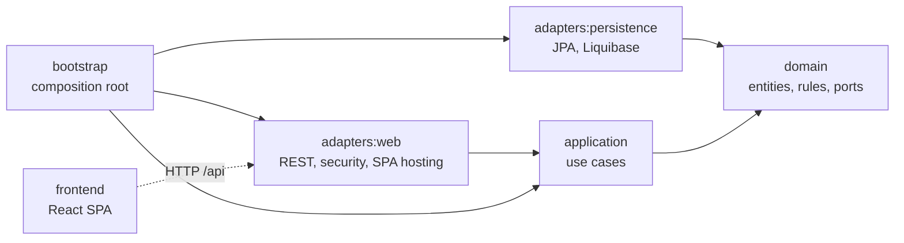

# Life Balance

A weekly planner built on Stephen Covey's *The 7 Habits of Highly Effective People*: projects and weeks hang off long-term values and life roles, not the other way round.

| | |
|---|---|
| **Mission** | Write a personal mission statement (Habit 2: begin with the end in mind). |
| **Values** | Rank the principles you live by. |
| **Roles** | Name the roles you play; *Sharpen the Saw* is built in and cannot be deleted (Habit 7). |
| **Goals** | Every goal belongs to a role and is tied to the values it serves; goals are achieved, dropped or reopened. |
| **Weekly planning** | Big rocks first: plan activities by role, goal and Covey quadrant, Quadrant II before anything else (Habit 3). |
| **Week and day view** | A Monday–Sunday grid, an unscheduled list and a focused day view with check-offs. |
| **Weekly review** | A scorecard of planned versus done, by quadrant and by role, plus the review itself and the four dimensions of renewal. |

A shared **guest** account opens a furnished demo planner (mission, values, roles, goals, this week planned, last week reviewed) that is wiped and refilled every night.

## Architecture

Clean Architecture in Gradle modules. Source dependencies point inward only; the build enforces it twice: a module cannot compile against an outer module, and ArchUnit rules fail the build if a class breaks the layering, a feature cycle appears, or the inner layers touch a framework.



| Module | Holds | Depends on |
|---|---|---|
| `domain` | Immutable entities and value objects (Java records), their invariants, repository ports | the JDK only |
| `application` | Use cases, split into `*Commands` (change state) and `*Queries` (answer) | `domain` |
| `adapters:persistence` | JPA entities, Spring Data repositories, the port implementations, Liquibase changelog | `domain`, Spring Data JPA, PostgreSQL |
| `adapters:web` | REST controllers, request and response records, RFC 9457 problem details, resource-server security, SPA hosting | `application`, Spring MVC, Spring Security |
| `bootstrap` | `main`, the wiring of every use case, transaction boundaries, configuration | everything |
| `frontend` | React 19 + TypeScript single-page app, served by the backend | the HTTP API |

Transactions wrap each use case from the outside: the composition root gives every `*CommandService` a read-write transaction and every `*QueryService` a read-only one, so the application layer stays free of framework annotations.

## Security

The app runs behind a per-app oauth2-proxy that signs users in against Keycloak (realm `luppol`). The app still trusts nothing it has not checked itself:

- it validates the Keycloak **access token** from the gateway's `X-Forwarded-Access-Token` header: RS256 signature against the realm's JWKS, issuer, audience `lifebalance`, expiry; an `Authorization` header is ignored;
- `/api/**` needs one of the realm roles `USER`, `ADMIN` or `guest`;
- every query and command is scoped to the signed-in person (the token's `sub`); another person's ids answer `404`, and composite foreign keys in PostgreSQL keep a goal or activity from pointing at someone else's role or goal even if the code were wrong;
- state-changing requests with `Sec-Fetch-Site: cross-site` are refused, and every response carries a strict Content-Security-Policy plus `Referrer-Policy`, `Permissions-Policy`, cross-origin opener and resource policies, `X-Frame-Options` and `nosniff`;
- the guest account is a sandbox: its data is reset nightly by the `demo-reset` command.

## Tech stack

Java 21 · Spring Boot 4.1 (Spring Framework 7, Spring Security 7, Hibernate 7) · PostgreSQL 16 · Liquibase 5 · Gradle 9 (Kotlin DSL, convention plugins, version catalog) · React 19 · TypeScript · Vite · TanStack Query · JUnit 6 · Testcontainers 2 · ArchUnit · PIT · JaCoCo · Vitest · Testing Library · MSW · Stryker

## Quality gates

`./gradlew build` fails unless all of these hold:

| Gate | Threshold |
|---|---|
| Unit and integration tests (integration tests run a real PostgreSQL 16 in Testcontainers) | all green |
| JaCoCo, per module | lines ≥ 90 %, branches ≥ 85 % |
| PIT mutation score, `domain` and `application` | ≥ 85 % |
| ArchUnit layering, cycle and placement rules | no violation |
| `javac -Xlint:all -Werror` | no warning |
| Frontend: ESLint (strict, type-checked), Prettier, `tsc` | clean |
| Frontend: Vitest coverage | statements, lines, functions ≥ 90 %, branches ≥ 85 % |

The frontend's Stryker mutation run (`npm run test:mutation`, break threshold 70 %) is kept out of the default build for time.

## Running it locally

Prerequisites: JDK 21, Docker, Node 24 (via nvm).

```bash
cp .env.example .env      # local database settings
./dev.sh backend          # PostgreSQL in Docker + the API on http://localhost:8080
./dev.sh frontend         # a local dev identity server + the app on http://localhost:5173
```

Locally the backend trusts a small development identity server (`frontend/dev/identity-server.mjs`) that signs real RS256 tokens; the Vite dev server adds them to API calls the way the gateway does in production. `DEV_ROLES=guest ./dev.sh frontend` signs in as the demo guest.

| Command | Does |
|---|---|
| `./dev.sh test` | the full build with every gate above |
| `./dev.sh demo-reset` | wipes and refills every guest workspace in the local database |
| `./dev.sh down` | stops the containers, keeps the data |
| `./dev.sh hard-reset` | stops the containers and **deletes** the local database |
| `./db/create_migration.sh <name>` | adds a Liquibase formatted-SQL changeset and registers it |

API documentation: `/v3/api-docs` and Swagger UI at `/swagger-ui.html`.

Reports after a build: `build/reports/jacoco/test/html` (coverage of all modules), `<module>/build/reports/pitest` (mutation), `<module>/build/reports/tests/test` (tests).

## Running it in production

The build produces one executable jar, `bootstrap/build/libs/life-balance.jar`, with the SPA inside. It listens on port 8080, applies database migrations on start, and reads its settings from the environment:

| Variable | Meaning | Default |
|---|---|---|
| `PG_HOST`, `PG_PORT`, `PG_NAME`, `PG_USER`, `PG_PASS` | PostgreSQL connection (schema `core` must exist) | none, required |
| `AUTH_ISSUER` | token issuer | `https://auth.luppol.com/realms/luppol` |
| `AUTH_JWK_SET_URI` | signing keys | the issuer's `/protocol/openid-connect/certs` |
| `AUTH_AUDIENCE` | required audience | `lifebalance` |
| `AUTH_TOKEN_HEADER` | header carrying the access token | `X-Forwarded-Access-Token` |
| `DEMO_TIME_ZONE` | time zone that decides "this week" for the demo data | `America/Chicago` |

Health: `/actuator/health/liveness` and `/actuator/health/readiness` (readiness includes the database). The nightly reset is `java -jar life-balance.jar demo-reset`: it refills the guest workspaces and exits.

## License

All rights reserved; see [LICENSE.md](LICENSE.md).
